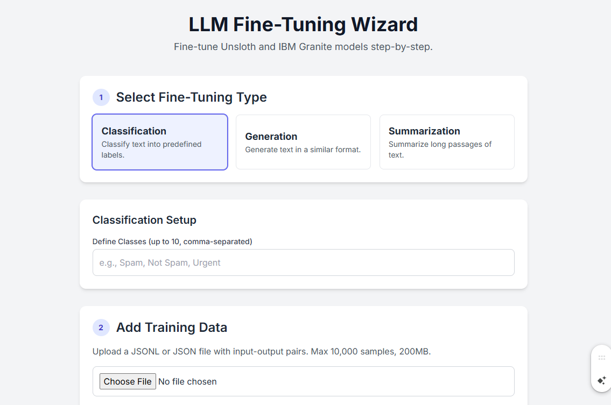

# Building a Fine-Tuning Wizard: A Step-by-Step Guide

Welcome to our series on building a complete web-based wizard for fine-tuning Large Language Models! In this series, we will create a user-friendly interface using Flask that allows users to fine-tune various Unsloth-compatible models for tasks like classification, generation, and summarization.

## Part 1: Project Structure and a Basic UI

Let's start by laying the groundwork for our application. A well-organized project is much easier to develop, debug, and maintain.

## The File Tree

Here’s the directory structure we'll be using for our project. It separates our Python logic, web templates, and static files.
```bash
finetuning_wizard/
├── app.py
├── finetuning.py
├── static/
│   └── css/
│       └── style.css
└── templates/
    └── index.html
```
finetuning_wizard/: The root directory for our project.

app.py: This will be the heart of our Flask application, 
handling web requests and routing.

finetuning.py: We'll place the core logic for model 

fine-tuning in this file.

static/: This directory will hold our CSS, JavaScript, and any images.

templates/: This is where our HTML templates will reside.
Now, let's create the initial files.

## The Flask Application (app.py)

This file will contain the main entry point and routing for our web application. For now, it will just render our main page.
app.py

```python

# app.py
from flask import Flask, render_template, request, jsonify
import os
import threading
import json

app = Flask(__name__)

# --- Configuration ---
# It's good practice to have configurations in one place.
# For a real application, consider using a separate config file.
app.config['UPLOAD_FOLDER'] = 'uploads'
os.makedirs(app.config['UPLOAD_FOLDER'], exist_ok=True)

# --- Routes ---

@app.route('/')
def index():
    """
    Renders the main page of the wizard.
    """
    return render_template('index.html')

@app.route('/start-finetuning', methods=['POST'])
def start_finetuning_route():
    """
    This endpoint will kick off the fine-tuning process.
    For now, it just simulates the start of the process.
    """
    data = request.json
    print("Received data:", data) # For debugging

    # In a real app, you would start the finetuning script here.
    # We will implement the actual call to finetuning.py later.

    # Example of how you might call the finetuning script in a background thread
    # from finetuning import run_finetuning
    # finetuning_thread = threading.Thread(target=run_finetuning, args=(data,))
    # finetuning_thread.start()

    return jsonify({"status": "success", "message": "Fine-tuning process started!"})


if __name__ == '__main__':
    # Running the app in debug mode is helpful for development.
    # In a production environment, you would use a proper WSGI server like Gunicorn.
    app.run(debug=True, port=5001)
```


The HTML Template (templates/index.html)
This is the user-facing part of our wizard. We'll use Tailwind CSS for styling to make it look clean and modern without much effort. The HTML is structured to guide the user through the fine-tuning process step-by-step.
templates/index.html

```html
<!DOCTYPE html>
<html lang="en">
<head>
    <meta charset="UTF-8">
    <meta name="viewport" content="width=device-width, initial-scale=1.0">
    <title>LLM Fine-Tuning Wizard</title>
    <script src="https://cdn.tailwindcss.com"></script>
    <link rel="stylesheet" href="https://cdnjs.cloudflare.com/ajax/libs/font-awesome/6.5.1/css/all.min.css">
    <link rel="preconnect" href="https://fonts.googleapis.com">
    <link rel="preconnect" href="https://fonts.gstatic.com" crossorigin>
    <link href="https://fonts.googleapis.com/css2?family=Inter:wght@400;500;600;700&display=swap" rel="stylesheet">
    <style>
        body {
            font-family: 'Inter', sans-serif;
            background-color: #f3f4f6;
        }
        .step-card {
            background-color: white;
            border-radius: 0.75rem;
            box-shadow: 0 4px 6px -1px rgb(0 0 0 / 0.1), 0 2px 4px -2px rgb(0 0 0 / 0.1);
            transition: all 0.3s ease-in-out;
        }
        .step-card:hover {
            box-shadow: 0 10px 15px -3px rgb(0 0 0 / 0.1), 0 4px 6px -4px rgb(0 0 0 / 0.1);
        }
        .btn-primary {
            background-color: #4f46e5;
            color: white;
            font-weight: 600;
            padding: 0.75rem 1.5rem;
            border-radius: 0.5rem;
            transition: background-color 0.3s;
        }
        .btn-primary:hover {
            background-color: #4338ca;
        }
        .input-field {
            width: 100%;
            padding: 0.75rem;
            border: 1px solid #d1d5db;
            border-radius: 0.5rem;
            transition: border-color 0.3s, box-shadow 0.3s;
        }
        .input-field:focus {
            outline: none;
            border-color: #4f46e5;
            box-shadow: 0 0 0 3px rgb(79 70 229 / 0.2);
        }
        .template-preview {
            background-color: #1f2937;
            color: #d1d5db;
            padding: 1rem;
            border-radius: 0.5rem;
            font-family: monospace;
            white-space: pre-wrap;
        }
    </style>
</head>
<body class="antialiased text-gray-800">

    <div class="container mx-auto p-4 sm:p-6 lg:p-8 max-w-4xl">
        <header class="text-center mb-10">
            <h1 class="text-4xl font-bold text-gray-900">LLM Fine-Tuning Wizard</h1>
            <p class="text-lg text-gray-600 mt-2">Fine-tune Unsloth and IBM Granite models step-by-step.</p>
        </header>

        <div class="space-y-8">
            <!-- Step 1: Select Fine-Tuning Type -->
            <div class="step-card p-6">
                <h2 class="text-2xl font-semibold mb-4 flex items-center"><span class="bg-indigo-100 text-indigo-700 rounded-full h-8 w-8 text-sm font-bold flex items-center justify-center mr-3">1</span>Select Fine-Tuning Type</h2>
                <div class="grid grid-cols-1 md:grid-cols-3 gap-4">
                    <button onclick="selectTuningType('classification')" class="p-4 border rounded-lg text-left hover:bg-indigo-50 hover:border-indigo-500 transition focus:outline-none focus:ring-2 focus:ring-indigo-500">
                        <h3 class="font-bold text-lg">Classification</h3>
                        <p class="text-sm text-gray-600">Classify text into predefined labels.</p>
                    </button>
                    <button onclick="selectTuningType('generation')" class="p-4 border rounded-lg text-left hover:bg-indigo-50 hover:border-indigo-500 transition focus:outline-none focus:ring-2 focus:ring-indigo-500">
                        <h3 class="font-bold text-lg">Generation</h3>
                        <p class="text-sm text-gray-600">Generate text in a similar format.</p>
                    </button>
                    <button onclick="selectTuningType('summarization')" class="p-4 border rounded-lg text-left hover:bg-indigo-50 hover:border-indigo-500 transition focus:outline-none focus:ring-2 focus:ring-indigo-500">
                        <h3 class="font-bold text-lg">Summarization</h3>
                        <p class="text-sm text-gray-600">Summarize long passages of text.</p>
                    </button>
                </div>
            </div>

            <!-- Classification Specific Options -->
            <div id="classification-options" class="step-card p-6 hidden">
                <h3 class="text-xl font-semibold mb-4">Classification Setup</h3>
                <label for="classes" class="block text-sm font-medium text-gray-700">Define Classes (up to 10, comma-separated)</label>
                <input type="text" id="classes" class="input-field mt-1" placeholder="e.g., Spam, Not Spam, Urgent">
            </div>

            <!-- Step 2: Add Training Data -->
            <div class="step-card p-6">
                <h2 class="text-2xl font-semibold mb-4 flex items-center"><span class="bg-indigo-100 text-indigo-700 rounded-full h-8 w-8 text-sm font-bold flex items-center justify-center mr-3">2</span>Add Training Data</h2>
                <p class="text-gray-600 mb-4">Upload a JSONL or JSON file with input-output pairs. Max 10,000 samples, 200MB.</p>
                <input type="file" id="dataFile" class="input-field">
                <div class="mt-4">
                    <h4 class="font-semibold mb-2">Data Format Preview (JSONL)</h4>
                    <div class="template-preview">{"input":"&lt;text&gt;","output":"&lt;text&gt;"}<br>{"input":"&lt;text&gt;","output":"&lt;text&gt;"}</div>
                </div>
            </div>
            
            <!-- Step 3: Configure Parameters -->
            <div class="step-card p-6">
                <h2 class="text-2xl font-semibold mb-4 flex items-center"><span class="bg-indigo-100 text-indigo-700 rounded-full h-8 w-8 text-sm font-bold flex items-center justify-center mr-3">3</span>Configure Parameters</h2>
                <div class="grid grid-cols-1 md:grid-cols-2 gap-6">
                    <div>
                        <label for="max-input-tokens" class="block text-sm font-medium text-gray-700">Maximum Input Tokens</label>
                        <input type="number" id="max-input-tokens" class="input-field mt-1" value="256">
                    </div>
                    <div>
                        <label for="max-output-tokens" class="block text-sm font-medium text-gray-700">Maximum Output Tokens</label>
                        <input type="number" id="max-output-tokens" class="input-field mt-1" value="128">
                    </div>
                </div>
            </div>

            <!-- Step 4: Verbalizer Template -->
            <div class="step-card p-6">
                 <h2 class="text-2xl font-semibold mb-4 flex items-center"><span class="bg-indigo-100 text-indigo-700 rounded-full h-8 w-8 text-sm font-bold flex items-center justify-center mr-3">4</span>Verbalizer Template</h2>
                 <p class="text-gray-600 mb-4">Do your prompts need special formatting?</p>
                <div class="flex items-center space-x-4">
                    <label><input type="radio" name="verbalizer" value="default" checked onchange="toggleVerbalizer(false)"> No, use default</label>
                    <label><input type="radio" name="verbalizer" value="custom" onchange="toggleVerbalizer(true)"> Yes, edit</label>
                </div>
                <div id="verbalizer-editor" class="mt-4 hidden">
                    <textarea id="verbalizer-template" class="input-field h-24">{{input}}</textarea>
                </div>
            </div>

            <!-- Step 5: Start Tuning -->
            <div class="text-center mt-10">
                <button id="start-tuning-btn" class="btn-primary text-xl" onclick="startTuning()">
                    <i class="fas fa-rocket mr-2"></i>Start Fine-Tuning
                </button>
            </div>
        </div>
        
        <!-- Status/Log Output -->
        <div id="status-log" class="mt-8 p-6 bg-gray-900 text-white rounded-lg shadow-inner hidden">
            <h3 class="text-xl font-semibold mb-4">Fine-Tuning Log</h3>
            <pre id="log-output" class="text-sm font-mono whitespace-pre-wrap h-64 overflow-y-auto"></pre>
        </div>

    </div>

    <script>
        let tuningType = '';

        function selectTuningType(type) {
            tuningType = type;
            // Highlight selected button
            document.querySelectorAll('button[onclick^="selectTuningType"]').forEach(btn => {
                btn.classList.remove('ring-2', 'ring-indigo-500', 'bg-indigo-50');
            });
            event.currentTarget.classList.add('ring-2', 'ring-indigo-500', 'bg-indigo-50');

            // Show/hide classification options
            const classOptions = document.getElementById('classification-options');
            if (type === 'classification') {
                classOptions.classList.remove('hidden');
            } else {
                classOptions.classList.add('hidden');
            }
        }

        function toggleVerbalizer(show) {
            document.getElementById('verbalizer-editor').classList.toggle('hidden', !show);
        }

        async function startTuning() {
            if (!tuningType) {
                alert('Please select a fine-tuning type first!');
                return;
            }

            const dataFile = document.getElementById('dataFile').files[0];
            if (!dataFile) {
                alert('Please upload a training data file!');
                return;
            }

            // Show log area
            const statusLog = document.getElementById('status-log');
            const logOutput = document.getElementById('log-output');
            statusLog.classList.remove('hidden');
            logOutput.textContent = 'Preparing to start fine-tuning...\n';
            
            const reader = new FileReader();
            reader.onload = async (event) => {
                const fileContent = event.target.result;
                
                const formData = {
                    tuningType: tuningType,
                    classes: document.getElementById('classes').value,
                    maxInputTokens: document.getElementById('max-input-tokens').value,
                    maxOutputTokens: document.getElementById('max-output-tokens').value,
                    useCustomVerbalizer: document.querySelector('input[name="verbalizer"]:checked').value === 'custom',
                    verbalizerTemplate: document.getElementById('verbalizer-template').value,
                    dataFileContent: fileContent,
                };

                logOutput.textContent += 'Sending request to server...\n';

                try {
                    const response = await fetch('/start-finetuning', {
                        method: 'POST',
                        headers: { 'Content-Type': 'application/json' },
                        body: JSON.stringify(formData),
                    });

                    const result = await response.json();

                    if (response.ok) {
                        logOutput.textContent += `Server responded: ${result.message}\n`;
                        logOutput.textContent += 'Fine-tuning process has been initiated in the background.\n';
                    } else {
                        throw new Error(result.message || 'An unknown error occurred.');
                    }

                } catch (error) {
                    logOutput.textContent += `Error: ${error.message}\n`;
                    console.error('Error starting fine-tuning:', error);
                }
            };

            reader.readAsText(dataFile);
        }
    </script>
</body>
</html>

```


The Fine-tuning Script (finetuning.py)
For now, this will be a placeholder file. In the next part of our series, we'll populate this with the actual Unsloth fine-tuning code.
finetuning.py


```python
# finetuning.py
import time
import torch
from unsloth import FastLanguageModel
from datasets import load_dataset
from trl import SFTTrainer
from transformers import TrainingArguments, DataCollatorForSeq2Seq
from unsloth.chat_templates import get_chat_template, standardize_sharegpt, train_on_responses_only
import json
import os

def run_finetuning(config):
    """
    This function will run the entire fine-tuning pipeline based on the user's configuration.
    
    Args:
        config (dict): A dictionary containing all the settings from the web UI.
    """
    print("--- Starting Fine-Tuning Process ---")
    print(f"Configuration received: {json.dumps(config, indent=2)}")

    try:
        # --- 1. Model and Tokenizer Setup ---
        print("\n[1/6] Loading model and tokenizer...")
        max_seq_length = 2048
        dtype = None
        load_in_4bit = True

        model, tokenizer = FastLanguageModel.from_pretrained(
            model_name="unsloth/Llama-3.2-3B-Instruct",
            max_seq_length=max_seq_length,
            dtype=dtype,
            load_in_4bit=load_in_4bit,
        )
        print("Model and tokenizer loaded successfully.")

        # --- 2. Add LoRA Adapters ---
        print("\n[2/6] Adding LoRA adapters...")
        model = FastLanguageModel.get_peft_model(
            model,
            r=16,
            target_modules=["q_proj", "k_proj", "v_proj", "o_proj",
                              "gate_proj", "up_proj", "down_proj"],
            lora_alpha=16,
            lora_dropout=0,
            bias="none",
            use_gradient_checkpointing="unsloth",
            random_state=3407,
        )
        print("LoRA adapters added.")

        # --- 3. Data Preparation ---
        print("\n[3/6] Preparing dataset...")
        
        # Save the uploaded file content to a temporary file
        temp_data_path = os.path.join('uploads', 'temp_data.jsonl')
        with open(temp_data_path, 'w') as f:
            # Assuming JSONL format, we write each line from the content
            lines = config['dataFileContent'].strip().split('\n')
            for line in lines:
                f.write(line + '\n')

        # Load the dataset from the temporary file
        dataset = load_dataset("json", data_files={"train": temp_data_path})["train"]

        # This part needs to be adapted based on the fine-tuning type
        # For now, we assume a conversational format.
        tokenizer = get_chat_template(tokenizer, chat_template="llama-3.1")

        # The formatting function needs to handle different structures
        def formatting_prompts_func(examples):
            # This is a generic example for Generation/Summarization
            # For classification, this would be different.
            inputs = examples["input"]
            outputs = examples["output"]
            texts = []
            for input_text, output_text in zip(inputs, outputs):
                # We create a simple user-assistant conversation
                convo = [
                    {"role": "user", "content": input_text},
                    {"role": "assistant", "content": output_text},
                ]
                texts.append(tokenizer.apply_chat_template(convo, tokenize=False, add_generation_prompt=False))
            return {"text": texts}

        dataset = dataset.map(formatting_prompts_func, batched=True)
        print("Dataset prepared and mapped.")
        print("Example of formatted text:", dataset[0]['text'])

        # --- 4. Trainer Setup ---
        print("\n[4/6] Setting up SFTTrainer...")
        trainer = SFTTrainer(
            model=model,
            tokenizer=tokenizer,
            train_dataset=dataset,
            dataset_text_field="text",
            max_seq_length=int(config.get('maxInputTokens', 2048)), # Use config value
            data_collator=DataCollatorForSeq2Seq(tokenizer=tokenizer),
            dataset_num_proc=2,
            packing=False,
            args=TrainingArguments(
                per_device_train_batch_size=2,
                gradient_accumulation_steps=4,
                warmup_steps=5,
                max_steps=60, # For quick testing
                learning_rate=2e-4,
                fp16=not torch.cuda.is_bf16_supported(),
                bf16=torch.cuda.is_bf16_supported(),
                logging_steps=1,
                optim="adamw_8bit",
                weight_decay=0.01,
                lr_scheduler_type="linear",
                seed=3407,
                output_dir="outputs",
                report_to="none",
            ),
        )
        print("Trainer configured.")

        # --- 5. Start Training ---
        print("\n[5/6] Starting training...")
        gpu_stats = torch.cuda.get_device_properties(0)
        start_gpu_memory = round(torch.cuda.max_memory_reserved() / 1024**3, 3)
        print(f"GPU = {gpu_stats.name}. Max memory = {round(gpu_stats.total_memory / 1024**3, 3)} GB.")
        print(f"{start_gpu_memory} GB of memory reserved before training.")
        
        trainer_stats = trainer.train()

        used_memory = round(torch.cuda.max_memory_reserved() / 1024**3, 3)
        print(f"Training completed in {trainer_stats.metrics['train_runtime']:.2f} seconds.")
        print(f"Peak reserved memory = {used_memory} GB.")
        
        # --- 6. Save Model ---
        print("\n[6/6] Saving final LoRA model...")
        output_dir = "lora_model"
        model.save_pretrained(output_dir)
        tokenizer.save_pretrained(output_dir)
        print(f"Model saved to '{output_dir}'.")
        print("\n--- Fine-Tuning Process Finished ---")

    except Exception as e:
        print(f"\nAn error occurred during fine-tuning: {e}")
        import traceback
        traceback.print_exc()

if __name__ == '__main__':
    # This part is for testing the script directly
    # You can create a dummy config to simulate a run from the web UI
    dummy_config = {
        "tuningType": "generation",
        "classes": "",
        "maxInputTokens": "256",
        "maxOutputTokens": "128",
        "useCustomVerbalizer": False,
        "verbalizerTemplate": "{{input}}",
        "dataFileContent": '{"input": "What is the capital of France?", "output": "Paris is the capital of France."}\n{"input": "Who wrote Romeo and Juliet?", "output": "William Shakespeare wrote Romeo and Juliet."}'
    }
    run_finetuning(dummy_config)

```

Next Steps
We now have a beautiful and responsive UI shell and the basic backend structure.

In our next blog post, we will:

Flesh out finetuning.py: We'll dive deep into the provided Unsloth script and adapt it to handle the different fine-tuning tasks (Classification, Generation, Summarization) based on the user's selections in the UI.
Handle File Uploads: We will properly handle the data file uploaded by the user.
Real-time Logging: We will implement a way to stream the logs from the fine-tuning script back to the user's browser in real-time.
Stay tuned! We're well on our way to creating a powerful and easy-to-use fine-tuning tool.